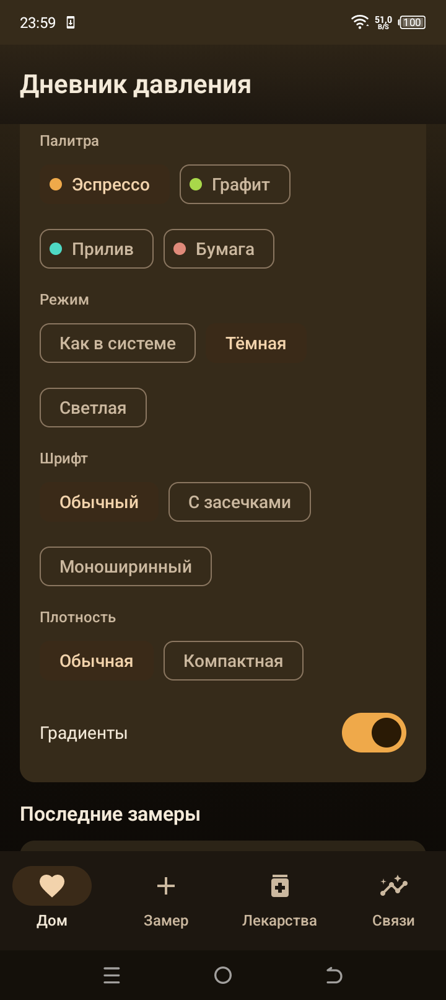
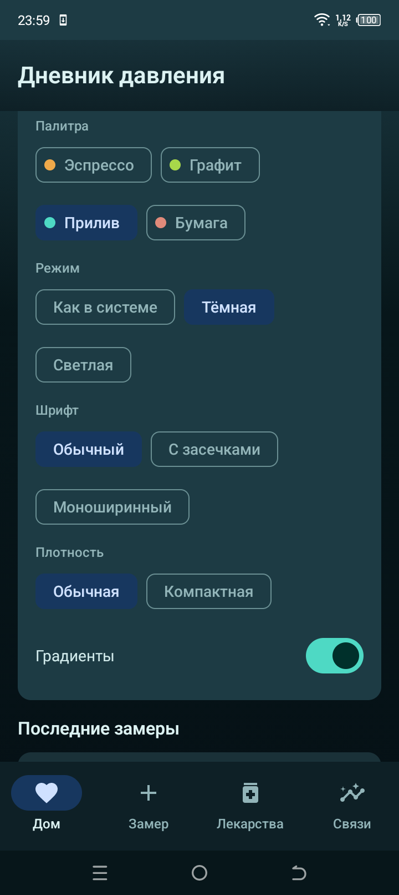
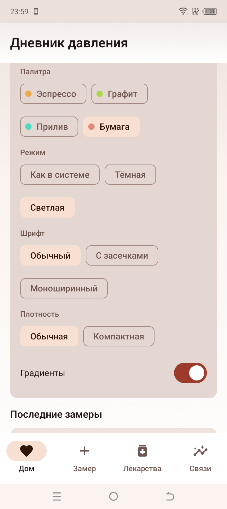
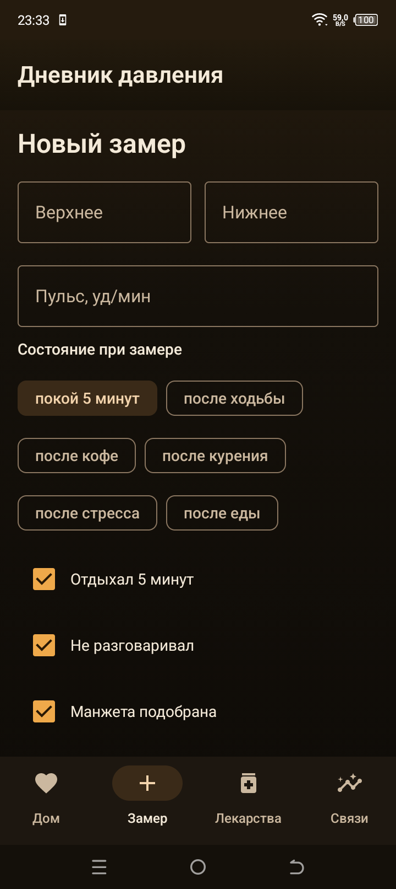

# Дневник давления (Chronic Notebook)

Нативное Android-приложение для самонаблюдения: замеры артериального давления, личная
база, разбор связей с погодой, расписание назначенных препаратов и напоминания,
работающие при закрытом приложении.

Все данные хранятся только на устройстве. Интернет нужен исключительно для получения
погоды.

## Оформление

Внешний вид настраивается на главном экране, в карточке «Оформление» — без
перезапуска, выбор сохраняется.

- **Палитра:** Эспрессо (тёплый чёрный и янтарь), Графит (сталь и лайм),
  Прилив (сине-зелёная база и мятный акцент), Бумага (светлый лист и бордовый
  сигнал внимания).
- **Режим:** как в системе, тёмная или светлая. У каждой палитры свой светлый
  вариант, а не одна тема с инверсией.
- **Шрифт:** обычный, с засечками или моноширинный — на моноширинном цифры
  давления выравниваются в столбик, список читается быстрее.
- **Плотность:** обычная или компактная — компактная уменьшает кегль и отступы,
  на экране помещается больше замеров.
- **Градиенты:** тумблер. Градиент на тёмной теме — это свет сверху и изнутри
  главной карточки, а не украшение; кому нужен ровный фон, выключает.

По умолчанию: Эспрессо, тёмная, обычный шрифт, обычная плотность, градиенты
включены.
## Возможности

- **Замеры** — ввод САД/ДАД/пульса с проверкой протокола: отдых 5 минут, отсутствие
  разговоров, подбор манжеты, состояние покоя. Некорректные замеры помечаются и не
  идут в статистику.
- **Метки** — собственный словарь: «после нагрузки», «стресс», «плохой сон» и
  любые свои названия. Метки ставятся при вводе замера и на старых карточках,
  видны в дневнике, работают фильтром на графике и сохраняются в файлах выгрузки.
- **График давления** — интерактивные линии верхнего и нижнего давления.
  Диапазоны 7/30/90 дней и всё время, фильтр по меткам, касание точки показывает
  дату, пульс и метки, график тянется и масштабируется. Линии 160 и 180
  появляются, если такие значения есть в выборке.
- **Файлы** — отчёт для врача сохраняется как PDF и CSV, полные замеры — как
  JSON и CSV. Сохранение всегда идёт через системный выбор места, отправка — через
  «Поделиться», разрешений на память нет. Импорт сначала показывает, сколько
  замеров новые, сколько уже есть и какие метки появятся, повторный импорт того
  же файла ничего не дублирует.
- **Пороги** — 180/120, 160/100, 140/90, 90/60. Для каждого уровня выводится
  заранее заданный текст. Тексты не генерируются моделью.
- **Личная база** — средние по четырём периодам суток (ночь, утро, день, вечер)
  после 14 корректных замеров, разброс САД.
- **Связи с погодой** — корреляция Пирсона между систолическим давлением и
  температурой, перепадом температуры за сутки, перепадом атмосферного давления;
  лаги 0, 24 и 48 часов. Порог отображения |r| ≥ 0.30, минимум 20 замеров,
  для отдельного фактора — не меньше 10 пар. Лаги 6 и 12 часов убраны: при
  округлении суток они давали ту же пару, что и 24 часа, и в отчёте для врача
  один фактор повторялся трижды.
- **Препараты** — только те, что уже назначены врачом. Поле «кто назначил».
  Любое время приёма через выбор часа и минут, без фиксированного списка
  слотов: циферблат даёт шаг 5 минут, ручной ввод — любую минуту.
  Редактирование карточки препарата с пересчётом уведомлений,
  adherence за 30 дней, отметка «Принял» прямо в уведомлении.
  Знаменателем adherence считаются только наступившие приёмы, поэтому
  «принято 5 из 190» больше невозможно. Откладывание «через N минут» отсчитывается
  от времени приёма и никогда не переносит напоминание раньше назначенного.
- **Напоминания** — точные будильники `AlarmManager` (`setAlarmClock`, работает
  в Doze), ступенчатая эскалация 0 / +15 / +45 / +120 минут, страховка
  `WorkManager` раз в 15 минут, восстановление расписа после перезагрузки и
  после обновления приложения.
- **Отчёт для врача** — текстовый отчёт за последние 30 дней, собирается по всей
  базе, а не по видимой части списка. Тот же отчёт сохраняется как PDF или CSV
  и отправляется через «Поделиться».
- **Автообновление** — пока приложение открыто, состояние пересчитывается само
  раз в 15 секунд и сразу после действий. Перезаходить на вкладку не нужно.

## Источники погоды

| Источник | Назначение |
|---|---|
| `yandex.ru/pogoda/<город>` | текущая погода, разбор `ld+json` |
| `archive-api.open-meteo.com` | история за 121 день, ключ не требуется |
| `api.open-meteo.com` | запасной вариант текущей погоды |

Если Яндекс недоступен, используется Open-Meteo. Синхронизация — раз в 6 часов
через `WorkManager` при наличии сети.

## Совместимость

| Параметр | Значение |
|---|---|
| Android | 6.0 и выше (minSdk 23) |
| Архитектуры | arm64-v8a, armeabi-v7a, x86, x86_64 (универсальный APK) |
| Google Play Services | не требуются |
| Сторонние SDK | только AndroidX, OkHttp, Gson и графическая библиотека Vico |
| Размер | около 2,5 МБ |

`java.time` работает на Android 6 за счёт desugaring, поэтому версия API-уровня
на установку не влияет.

## Если напоминания не приходят

Внутри приложения есть карточка «Диагностика» на вкладке «Дом»: она показывает
модель телефона, версию Android, состояние точных будильников, оптимизацию батареи
и причину последнего сбоя, если он был. Там же есть кнопки, открывающие нужные
настройки.

Для Infinix (XOS) и других прошивок с агрессивной экономией батареи дополнительно:

1. Настройки → Приложения → Дневник давления → Разрешения → включить уведомления.
2. Настройки → Приложения → Дневник давления → «Будильники и напоминания» → включить.
3. Настройки → Батарея → «Автозапуск» / «Запуск в фоне» → включить для приложения.
4. В списке приложений оставьте включённым «Не экономить батарею».

Прошивка может всё равно не доставить уведомление, пока включена агрессивная
оптимизация. На карточке «Диагностика» это видно по строке «Оптимизация батареи».

Важно: общую важность уведомлений приложения система не разрешает поднять из
кода — на MIUI и HiOS её нужно выставить вручную («Высокая»). Внутри приложения
есть кнопка «Настройки уведомлений», которая открывает нужный экран.

## Что нового в 0.7

Метки, график и файлы:

- Время приёма больше не теряет минуты: выбранные 12:45 сохранялись как
  12:00 из-за приоритета операторов в `times + hour * 60 + minute`. Теперь
  слот считается одной формулой, плюс есть ручной ввод любой минуты.
- Карточка препарата перечитывает расписание после каждой правки, а интерфейс
  сам обновляется раз в 15 секунд, пока приложение открыто.
- Словарь меток, интерактивный график давления, экспорт отчёта в PDF/CSV и
  выгрузка/загрузка замеров в JSON/CSV с предпросмотром импорта.
- База обновляется с версии 1 до 2 без потери истории: миграция добавляет
  только таблицы тегов.
- Тёплый чёрный дизайн: фирменный эспрессо-фон, янтарный акцент, градиенты
  экрана, шапки и карточки сводки. Динамические цвета системы отключены,
  чтобы оформление не перекрашивалось под обои.

## Что исправлено в 0.6

Напоминания о приёме:

- Кнопка «Принял» в уведомлении не работала вообще: получатель действия не был
  зарегистрирован в манифесте.
- Ступени эскалации были 0/+15/+30/+45 вместо 0/+15/+45/+120, и последнее
  напоминание через два часа не приходило никогда.
- Гонка «будильник ↔ страховка» присылала два одинаковых уведомления.
- Ошибка показа уведомления проглатывалась, ступень считалась отправленной, и
  приём мог навсегда остаться без напоминания.
- После обновления приложения система снимает будильники — расписание
  восстанавливается по `MY_PACKAGE_REPLACED`.
- Уведомление снималось только после прокрутки шторки; теперь исчезает сразу
  после «Принял».
- Вечером открытое приложение молча отменяло подсказку о замере на следующее
  утро.

Данные и статистика:

- adherence считал в знаменатель будущие приёмы.
- Отчёт для врача строился по последним 200 записям, счётчики выходили заниженными.
- Счётчик «Без 5-минутного покоя» был инвертирован.
- Пропуски погоды выдавались за нулевые значения.
- Карточки «Личная база», «Погода» и adherence не пересчитывались после
  сохранения замера: счётчик оставался нулевым до перезапуска приложения.

Интерфейс:

- Кнопки карточки напоминаний не помещались на экранах 360 dp: перенесены
  через `FlowRow`, проверено при системном шрифте до 200 %.

## Как тестировать

```bash
./gradlew :app:testDebugUnitTest     # 74 теста, без Android-эмулятора
./gradlew :app:connectedDebugAndroidTest  # тест миграции базы на устройстве
./gradlew :app:assembleRelease
```

Сценарий на устройстве, который стоит пройти после установки:

1. «Дом» → «Проверить звук сейчас»: должен пройти будильник и появиться
   уведомление с датой приёма.
2. «Лекарства» → «Добавить препарат», задать время на 2–3 минуты вперёд.
3. Дождаться уведомления, нажать «Принял»: уведомление исчезает, приём
   пропадает из списка «Ожидают отметки».
4. «Замер» → ввести 185/125: карточка должна показать «кризис» и подсказку
   про 103.
5. «Дом» → «Собрать отчёт»: в отчёте видны все замеры, а не 200 последних.
6. «Связи» → добавить метку «стресс», поставить её на замер, проверить фильтр
   графика; затем снять метку и удалить её из словаря.
7. «Связи» → «Выгрузить JSON», затем «Загрузить замеры» и выбрать тот же файл:
   план должен показать ноль новых замеров и все строки как совпадения.
8. Перезагрузить телефон: будильники должны восстановиться сами.

Проверенные устройства: Redmi Note 13 Pro (Android 16) и TECNO BF7 (Android 12).
Вёрстка проверена на 360 dp при системном шрифте 100/130/150/200 %, при
density 480 и в ландшафтной ориентации.

## Установка

Скачайте `app-release.apk` из раздела Releases и установите на телефон
(Android 6.0 и выше). Если установщик телефона отказывает, удалите прежнюю версию
и поставьте заново — это сбросит права.

APK подписан схемами v1, v2 и v3: часть прошивок Infinix и HiSense не принимает
пакеты только с подписью v2.

## Сборка из исходников

Требуются JDK 17 и Android SDK 35. Путь к SDK указывается в `local.properties`
или через переменную `ANDROID_HOME`.

```bash
# release.jks и keystore.properties исключены из репозитория
./gradlew :app:assembleRelease
./gradlew :app:testDebugUnitTest
```

APK: `app/build/outputs/apk/release/app-release.apk`

## Ограничения

Приложение не ставит диагноз, не назначает, не отменяет и не корректирует лечение.
Оно фиксирует показания и разбирает их по заранее заданным порогам. Решения о терапии
принимает врач. При кризисном давлении 180/120 и выше с плохим самочувствием —
скорая 103.

## Лицензия

MIT. См. [LICENSE](LICENSE).
## Снимки с телефона

Все снимки сделаны на TECNO BF7 (Android 12) на подписанном APK, не на эмуляторе.

### Оформление: палитра, режим, шрифт, плотность, градиенты



### Палитра «Прилив», тёмная



### Палитра «Бумага», светлая



### Экран замера: чипы состояния переносятся сами


